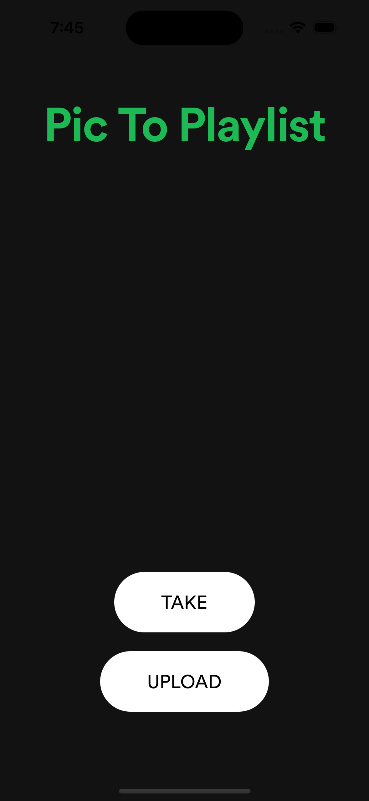
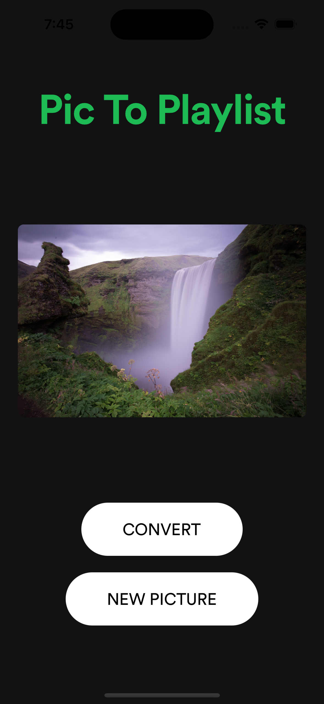
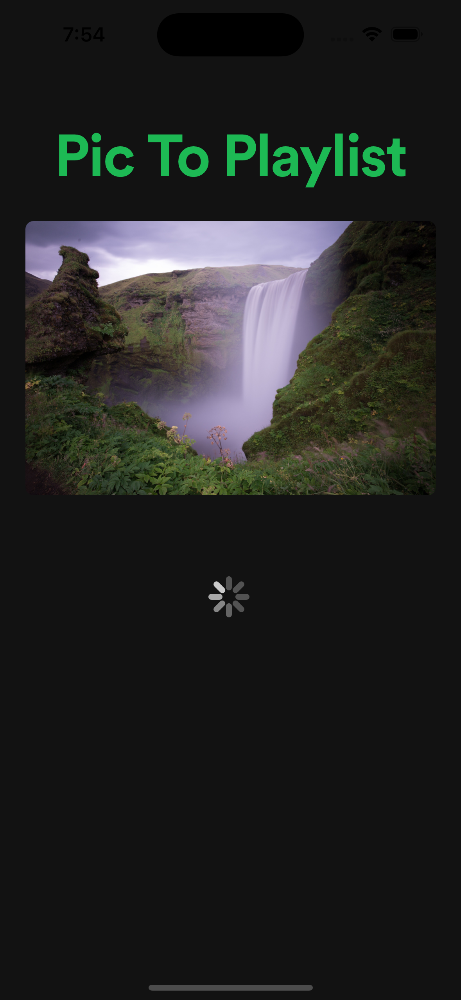
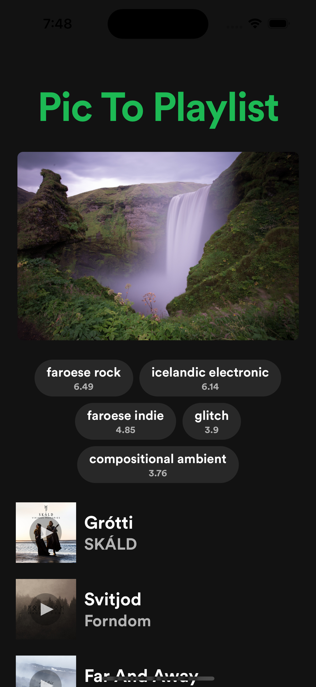
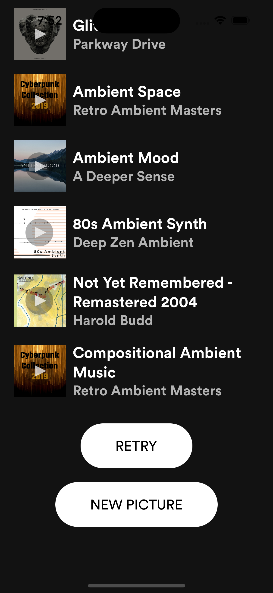

# Pic to Playlist

Pic To Playlist is a React Native application that allows users to upload or take a photo, analyze it to extract features, and generate a music playlist based on the image's characteristics using the Spotify API. The project includes a React Native frontend, an Express backend, and a Flask service for image analysis.

## Table of Contents

* Features
* Installation
* Usage
* Contributing
* License


## Features
Upload or take a photo using the React Native app.
Analyze the photo to extract key features.
Generate a Spotify playlist based on the image's features.

<p align="center">
  
  
  
  
  
</p>


## Installation

### Prerequisites
* Node.js
* Expo CLI
* Python
* pip
* Spotify Developer Account
* Backend (Express)

<br>

1. Clone the repository:
```
git clone https://github.com/yourusername/pic-to-playlist.git
cd pic-to-playlist/backend
```

2. Install dependencies:

client
```
npx expo install
```

server
```
npm install
pip install -r requirements.txt
```

3. Create a .env file in the backend directory with the following variables:

client/.env
```
NODE_ADDRESS = "http://kevinsfunzone.com"
NODE_PORT = 33333
```
server/.env
```
NODE_ADDRESS = "http://kevinsfunzone.com"
NODE_PORT=33333
FALSK_ADDRESS="http://kevinsfunzone.com"
FLASK_PORT=52525
SPOTIFY_CLIENT_ID=""
SPOTIFY_CLIENT_SECRET=""
```


## Usage
Ensure your device or simulator is set up to run the Expo app.
1. Start the Express server and Flask service as described in the 
2. Start the Expo server for the React Native app.
```
npx expo start // client
node server.js // exporess server
python app.py // flask server
```
3. Open the Expo app on your device or emulator.
4. Use the app to upload or take a photo.
5. The app will analyze the photo, generate a Spotify playlist, and display it along with the extracted features.


## Contributing
Contributions are welcome! Please follow these steps to contribute:

1. Fork the repository.
2. Create a new branch (git checkout -b feature/your-feature).
3. Commit your changes (git commit -m 'Add some feature').
4. Push to the branch (git push origin feature/your-feature).
5. Create a new Pull Request.
