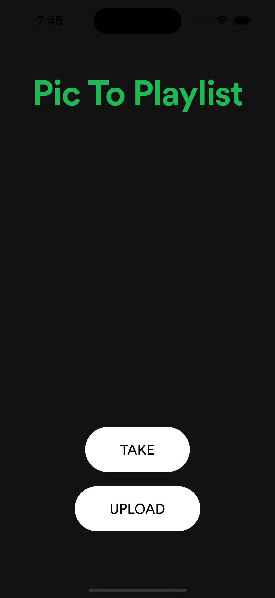
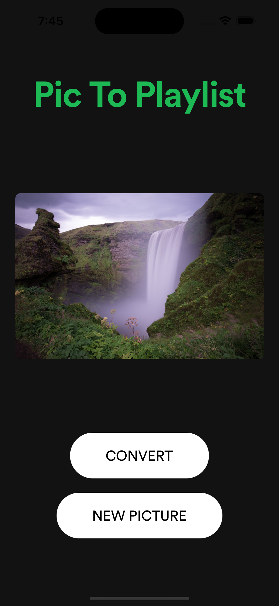
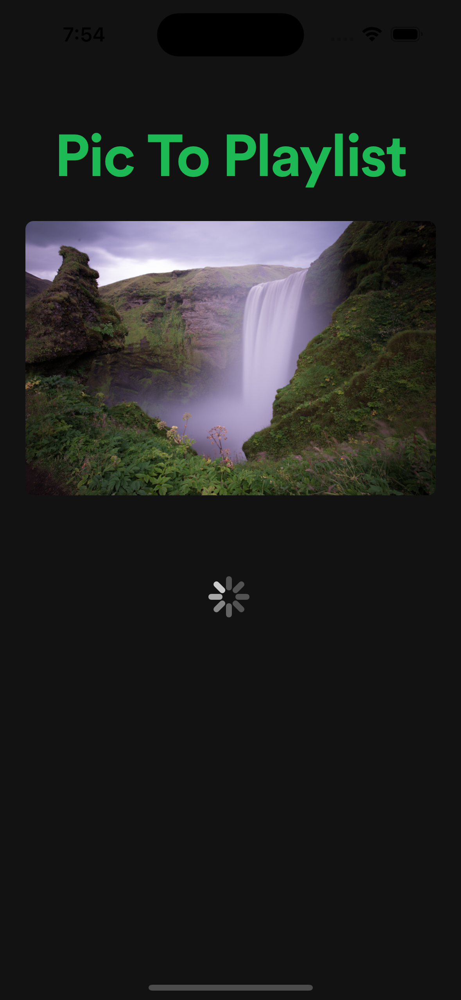
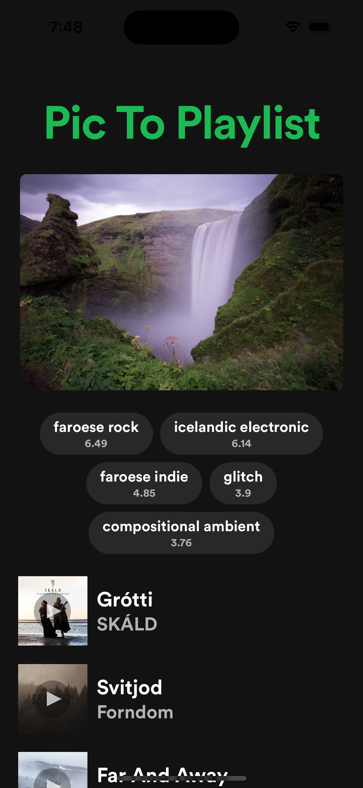
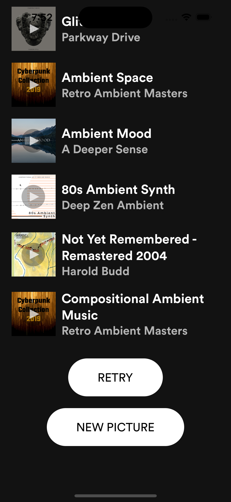

# Pic to Playlist

Pic to Playlist turns an uploaded or captured image into visual features and a
Spotify playlist. The active application consists of an Expo frontend, a Node
API for playlist generation, and the shared Aesthetic Matcher image-analysis
backend.

The public application is available at
[kevinatruong.com/pic-to-playlist](https://kevinatruong.com/pic-to-playlist/).

<p align="center">
  
  
  
  
  
</p>

## Repository layout

```text
pic-to-playlist/
├── frontend/                    # Active Expo application
├── backend/
│   ├── api/                     # Node and Spotify application logic
│   └── image-analysis/          # Synchronized shared backend copy
├── research/
│   └── label-curation/          # Genre-label experiments and tools
├── legacy/
│   ├── flask-backend/           # Original standalone Flask backend
│   ├── linux-runtime-before-restructure/ # Preserved manual Linux edits
│   └── deployment-scripts/      # Disabled manual deployment history
├── docs/
│   ├── ARCHITECTURE.md
│   └── images/
├── deployment/
│   └── systemd/                # Versioned Linux service definition
└── .github/workflows/           # Build and deployment pipelines
```

`backend/image-analysis` is synchronized from Aesthetic Matcher. Make shared
inference changes in the Aesthetic Matcher repository. Pic to Playlist owns
`backend/api`, which calls image analysis and Spotify to generate playlists.

## Frontend development

```bash
cd frontend
cp .env.example .env
npm ci
npm run web
```

## API development

```bash
cd backend/api
cp .env.example .env
npm ci
node server.js
```

Production credentials are not stored in the repository. See
`docs/ARCHITECTURE.md` for deployment and ownership details.
